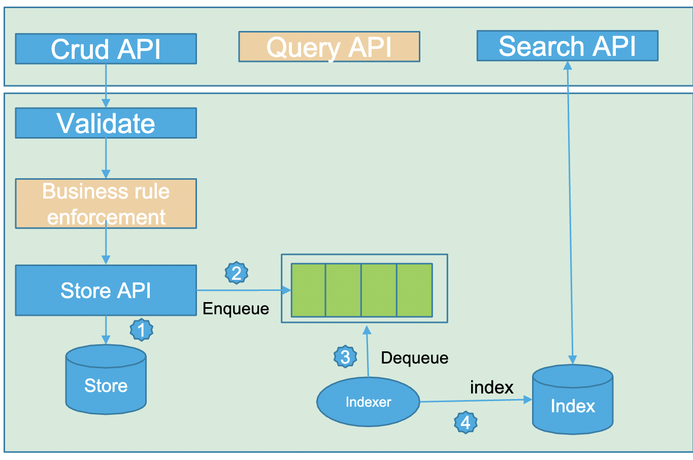

# Big Data Architecture for Distributed Systems 🌐

## Advanced Big-Data Applications and Indexing Techniques 📊
**Professor: Dr. Marwan Sabbouh**
## Introduction 📜
In the era of Big Data 📊, traditional relational database techniques are struggling to cope with the unprecedented volume 📈, variety 🌈, and velocity 💨 of new data points. This has created bottlenecks at every stage of the data processing chain, necessitating a shift towards more robust Big Data architectures, particularly for distributed software systems.

## Challenges in Data Handling 🚧

### Data Ingestion and Validation 🔄
- **Rapid Validation** 🔍: At the outer endpoints of distributed systems, there's a critical need to quickly validate incoming data to maintain quality.

### Data Storage 💾
- **Write Latency** ⏱️: For applications with a significant user base, write latency must not exceed tens of milliseconds to ensure real-time responsiveness.

### Data Indexing 📑
- **Indexer Throughput** 🚀: The system must maintain a high indexer throughput rate to keep up with the increasing velocity of incoming data.
- **Advanced Indexing Features** 🛠️: Support for logical operators, wildcards, geolocation, join, and aggregate queries is essential.

## Near Real-Time Predictive Analytics ⏳
- **Minimized Workflow Duration** 🕒: The duration for ingesting, storing, indexing, and analyzing data must be kept to a minimum to leverage new data points quickly for real-time analytics.

## Schemaless System Design 📐
- **Extensibility and Flexibility** 👐: The system must support the extensibility of its data models and the addition of new models without requiring new programming, emphasizing a schema-less design.



Rest APIs that can handle any structured data in JSON format, emphasizing advanced big data applications and indexing techniques.

## Key Concepts 🔑

### JSON and REST API 🌐
- **JSON as Graph**: Handling JSON data represented as a graph 📈.
- **REST API Features** 🛠️:
  - Specify URIs, status codes, headers, data model, version.
  - CRUD operations support, including merge/patch and cascaded delete.
  - Etag, If-Match, If-None-Match headers.
  - Advanced semantics for operations like conditional read and write, update if not changed.
- **Validation**: REST API with support for validation using JSON Schema 📝.
- **Controller**: Validates incoming payloads (json document with multiple nested objects) against the JSON schema.
- **Strongly Typed Data Protocol**: Utilization of AJV for JSON schema validation 📊.

### Storage and Search 🗄️
- **Data Storage**: Storing data in a key/value store, with Redis used for caching solutions 💾.
- **Elastic Search**: For search and retrieval capabilities, including parent-child indexing and field-specific searches 🔍.

### Security and Authorization 🔒
- **Security Mechanism**: Using RS 256 for security, with Google IDP for generating tokens.
- **OAuth 2.0 Workflow** 💳:
  - Client app registration and token request with OAuth/Authorization Server.
  - Use of bearer tokens in HTTP requests.
  - Relevant OAuth details like client ID, client secret, token type, redirect URI, auth URL, access token URL, and scope.

## Setup and Execution Steps 🚀

```bash
Elasticsearch and Kibana 📊
# Start Elasticsearch
cd elasticsearch-7.17.15/
./bin/elasticsearch
# Access Elasticsearch at http://localhost:9200/
# Access Kibana Console at http://localhost:5601/app/dev_tools#/console

# Start Kibana
cd kibana-7.17.15-darwin-x86_64/
./bin/kibana

Redis 🗃️
# Start Redis
redis-cli
# Default port: 6379

RabbitMQ 📬
# Start RabbitMQ
brew services start rabbitmq
# Access RabbitMQ at http://localhost:15672/#/

NodeJS Application Run Steps 💻
# Install dependencies
npm install

# Start the application
nodemon index.js

## Sample JSON Payload

```json
{
  "planCostShares": {
    "deductible": 2000,
    "_org": "example.com",
    "copay": 1,
    "objectId": "1234vxc2324sdf-501",
    "objectType": "membercostshare"
  },
  "linkedPlanServices": [
    {
      "linkedService": {
        "_org": "example.com",
        "objectId": "1234520xvc30asdf-502",
        "objectType": "service",
        "name": "Yearly physical"
      },
      "planserviceCostShares": {
        "deductible": 10,
        "_org": "example.com",
        "copay": 20,
        "objectId": "1234512xvc1314asdfs-503",
        "objectType": "membercostshare"
      },
      "_org": "example.com",
      "objectId": "27283xvx9asdff-504",
      "objectType": "planservice"
    },
    {
      "linkedService": {
        "_org": "example.com",
        "objectId": "1234520xvc30sfs-505",
        "objectType": "service",
        "name": "linked service"
      },
      "planserviceCostShares": {
        "deductible": 10,
        "_org": "example.com",
        "copay": 175,
        "objectId": "1234512xvc1314sdfsd-506",
        "objectType": "membercostshare"
      },
      "_org": "example.com",
      "objectId": "27283xvx9sdf-507",
      "objectType": "planservice"
    }
  ],
  "_org": "example.com",
  "objectId": "12xvxc345ssdsds-508",
  "objectType": "plan",
  "planType": "inNetwork",
  "creationDate": "12-12-2017"
}

## Testing Queries for Elasticsearch 🧪

### Delete Insurance Plan Index
```json
DELETE /insurance_plan_index

### Search in Insurance Plan Index

# Query All Documents
GET /insurance_plan_index/_search
{
  "query":{
    "match_all": {}
  }
}


# Get Parent with Specific Child Conditions
GET /insurance_plan_index/_search
{
  "query": {
    "has_child": {
      "type": "planserviceCostShares",
      "query": {
        "range": {
          "copay": {
            "gte": 1
          }
        }
      }
    }
  }
}

# Get Child Objects with Specific Parent
GET /insurance_plan_index/_search
{
  "query": {
    "has_parent": {
      "parent_type": "linkedPlanServices",
      "query": {
        "bool": {
          "must": [
            {
              "match": {
                "objectId": "27283xvx9asdff-504"
              }
            }
          ]
        }
      }
    }
  }
}

# Get Objects with a Specific Parent Type
GET /insurance_plan_index/_search
{
  "query": {
    "has_parent": {
      "parent_type": "plan",
      "query": {
        "match_all": {}
      }
    }
  }
}

# Search by Object ID
GET /insurance_plan_index/_search
{
  "query": {
    "match" : {
      "objectId": "1234512xvc1314sdfsd-506"
    }
  }
}
